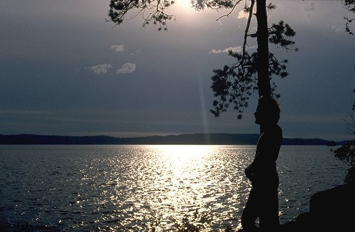
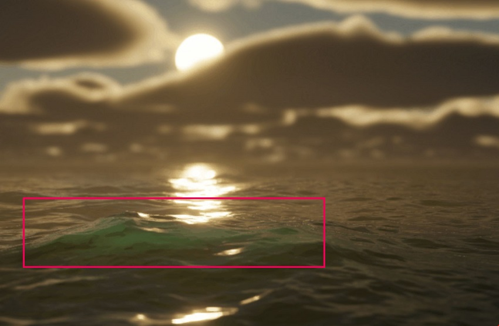

# Materials in the water system
The environment affects water surfaces in ways beyond winds and currents. A river thick with mud or crushed stone is less smooth and transparent than a freshly cleaned swimming pool. Suspended particulates or air bubbles, and depth all have a significant impact on water's appearance.

**Appearance** properties for HDRP's water implementation make it possible for you to adjust the water Material in a physically plausible way.

## Smoothness
At a distance, it is harder to perceive the details of a water surface. Adjust the **Close** and **Distant** properties to determine how close to the camera HDRP should start to reduce smoothness in order to simulate the way distant reflection behaves in the real world, where specular reflection appears larger at a distance.

[//]: # (Comment: Illustration is ublic domain file from commons.wikimedia.org / wiki / File:Sunset_at_Saimaa_Lake.jpg)
## Refraction
If you increase **Absorption Distance** the camera can see further into the water. A higher **Absorption Distance** makes caustics and the refraction effect controlled by **Maximum Distance** more visible.

The **Maximum Distance** property determines the point in meters from the camera at which HDRP no longer renders the refraction effect. A higher value increases distortion.

## Scattering
As you increase the values of the first three properties in this section of the **Appearance** properties, the water surface becomes both brighter (as captured light diffuses through the water) and more opaque (because it begins to absorb more light and let less through).

**Direct Light Body Term** and **Direct Light Tip Term** (the second of these is only for **Ocean, Sea, or Lake** water surface types) increase the intensity of light visible through waves, as at the wave tips in the screenshot below. **Direct Light Tip Term** is most visible at grazing angles.

## Custom Materials
To create a custom water Material, copy the default water Material and adjust that copy. The [water ShaderGraph](WaterSystem-ShaderGraph.md) documentation provides more information about which properties you can adjust.

## Additional resources
* [Foam in the water system](WaterSystem-foam.md)
* [Caustics in the Water System](WaterSystem-caustics.md)
* [Settings and properties related to the Water System](WaterSystem-Properties.md)
